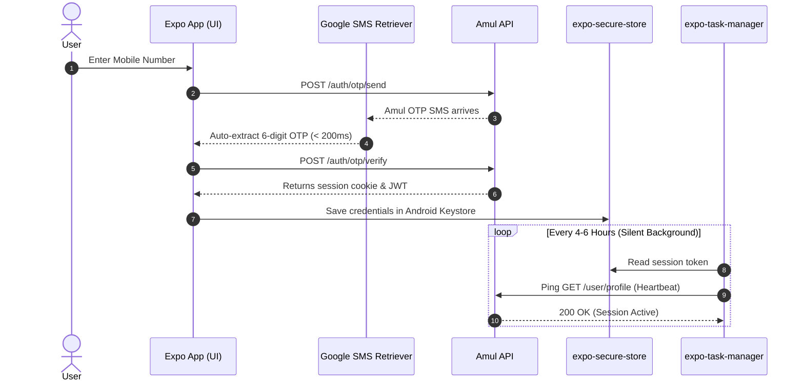
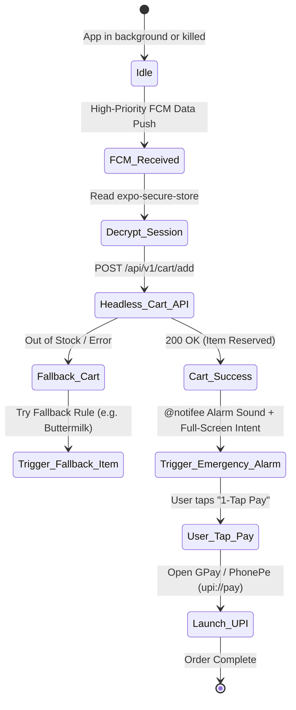

# Amul Flash — Product & Technical Requirements Document (PRD)

---

## 1. Executive Summary & Vision

### 1.1 Problem Statement
Amul's high-protein line (**High Protein Whey, Protein Lassi 15g/25g, Protein Buttermilk 15g, High Protein Paneer, and specialty dairy**) are exclusively sold on `shop.amul.com` and suffer from severe supply bottlenecks across Indian metro and tier-2 pincodes. Products restock irregularly and sell out within **2 to 5 minutes**. 

Existing solutions (such as the reference project [`amul-notify`](https://github.com/SwapnilSoni1999/amul-notify) Telegram bot) have critical drawbacks:
* Notifications get buried in chat lists with regular notification sounds.
* Requires manual website navigation, repeated OTP logins, and slow browser carting where items sell out mid-checkout.
* Tracks only one pincode at a time with text-based commands.
* No automatic reservation, fallback options, or restock time prediction.

### 1.2 App Vision
A dedicated, high-performance mobile application built with **React Native (Expo Prebuild)** that acts as an **all-in-one restock monitor and instantaneous flash checkout assistant** for Amul D2C products, enabling users to:
1. **Never miss a drop** via emergency alarm overrides (`@notifee/react-native`) and glanceable Android home screen widgets.
2. **Beat the rush** through persistent session caching (`expo-secure-store`) and instantaneous **Headless Auto-Cart Reservation** triggered via silent FCM data pushes.
3. **Checkout in < 3 seconds** via 1-tap UPI deep-linking to Google Pay, PhonePe, Paytm, or CRED.
4. **Strategize purchases** using multi-pincode radius radar, fallback variant rules, and predictive restock drop patterns.

---

## 2. System Design & End-to-End Architecture

```
                                  +-------------------------------------------------------------+
                                  |                     Amul D2C Cloud API                      |
                                  |              (shop.amul.com / Akamai Gateway)               |
                                  +-------------------------------------------------------------+
                                                 ▲                                ▲
                                                 │ Inventory Polling              │ Headless Add-to-Cart
                                                 │ (Rotating Proxies)             │ (Direct User Session)
                                                 │                                │
+---------------------------------------------------------------------------------------------------------------------------------+
|                                                   BACKEND CLUSTER TIER                                                          |
|                                                                                                                                 |
|   +------------------------------------+   +------------------------------------+   +---------------------------------------+   |
|   |      Dynamic Poller Service        |   |    Delta Diff & Change Detector    |   |         FCM Dispatch Gateway          |   |
|   |  - Group by Pincode & Store ID     |-->|  - Redis Hash Cache (SHA256)       |-->|  - Topic Broadcast (pincode_560034)   |   |
|   |  - Dynamic Jitter & Proxy Pool     |   |  - Instant Stock State Transition  |   |  - High-Priority Data Payload (<200ms)|   |
|   +------------------------------------+   +------------------------------------+   +---------------------------------------+   |
|                                                                                                                                 |
|   +-------------------------------------------------------------------------------------------------------------------------+   |
|   |  Telemetry & Analytics Engine: MongoDB/PostgreSQL (Drop timestamps, survival duration, time-series prediction models)   |   |
|   +-------------------------------------------------------------------------------------------------------------------------+   |
+---------------------------------------------------------------------------------------------------------------------------------+
                                                              │
                                                              │ High-Priority Push (Data Message)
                                                              ▼
+---------------------------------------------------------------------------------------------------------------------------------+
|                                             REACT NATIVE (EXPO) CLIENT ENGINE                                                   |
|                                                                                                                                 |
|  [Background Headless JS Layer] (Runs even when app is killed)                                                                  |
|   ├── 1. FCM Background Receiver (@react-native-firebase/messaging)                                                             |
|   ├── 2. Decrypt Session from expo-secure-store (Android Keystore)                                                              |
|   ├── 3. Fire Pre-emptive Headless POST /api/v1/cart/add (Instant Cart Lock < 300ms)                                            |
|   └── 4. Invoke Notifee Emergency Alarm Notification (Full-screen Intent & Audio Override)                                      |
|                                                                                                                                 |
|  [Foreground UI & Native Modules Layer]                                                                                         |
|   ├── UI Engine: React Native + StyleSheet + Reanimated + Lucide Icons                                                         |
|   ├── Session Keeper Daemon: expo-task-manager (Periodic 4-6h silent token refresh heartbeat)                                    |
|   ├── Zero-Click OTP: react-native-otp-verify (Google Play Services SMS Retriever API)                                         |
|   ├── 1-Tap Flash Checkout: Linking.openURL('upi://pay?...') (Direct GPay / PhonePe / Paytm handover)                           |
|   └── Glanceable Home Screen Widgets: react-native-android-widget (Live stock status pills)                                     |
+---------------------------------------------------------------------------------------------------------------------------------+
```

---

## 3. Comprehensive Feature Architecture & Specifications

### Feature 1: Smart Session Keeper & Zero-Click OTP
* **One-Time Setup:** User enters mobile number during onboarding. Amul fires an SMS OTP.
* **Zero-Click SMS Retriever API:** `react-native-otp-verify` uses Google Play Services `SmsRetrieverClient` to intercept the Amul SMS and automatically extract the 6-digit OTP code in `< 300ms` without user interaction.
* **Encrypted Token Persistence:** Amul's `_amul_session` cookie and Bearer tokens are stored in `expo-secure-store`, backed by the hardware-level **Android Keystore (AES-256 GCM)**.
* **Background Session Keeper Daemon:** `expo-background-fetch` + `expo-task-manager` run every 4–6 hours to send a lightweight heartbeat (`GET /api/v1/user/profile`). If Amul returns `401 Unauthorized`, a silent local notification prompts the user to re-authenticate before the next restock.



---

### Feature 2: High-Priority Emergency Alarm & Notification Engine
* **DND & Silent Mode Bypass:** `@notifee/react-native` initializes an Android Notification Channel with `AudioAttributes.USAGE_ALARM`, `importance: AndroidImportance.HIGH`, and `bypassDnd: true`.
* **Lockscreen & Full-Screen Intent:** When a high-demand item drops, a persistent heads-up card wakes the device screen with high-intensity vibration and custom audio.
* **Direct Notification Actions:**
  * `[ ⚡ Pay Now (1-Tap UPI) ]` $\rightarrow$ Launches UPI intent immediately.
  * `[ 🛒 View Cart ]` $\rightarrow$ Opens app directly to cart review screen.
  * `[ ⏰ Snooze 5m ]` $\rightarrow$ Mutes alarm for 5 minutes.

---

### Feature 3: Instant "Auto-Cart" Headless Reservation Bot
* **The Race Condition Problem:** In high-traffic drops, items sell out in under 2 minutes. Opening a push notification, unlocking the phone, and clicking "Add to Cart" is too slow.
* **Headless Reservation Architecture:** 
  1. FCM sends a **High-Priority Data Message** (`RESTOCK_EVENT`).
  2. Android wakes React Native's background runtime (`setBackgroundMessageHandler`).
  3. The headless script fetches the cached session from `expo-secure-store` and executes `POST /api/v1/cart/add` in **< 300ms**.
  4. Amul locks the product inventory for the user's cart session.
  5. The emergency alarm triggers **after** the item is already safely reserved.



---

### Feature 4: 1-Tap UPI Flash Checkout
* **Pre-Configured Address:** During onboarding, user selects their default delivery address ID (`address_id`).
* **Instant Checkout Handover:**
  * App fires `POST /api/v1/checkout/initialize` with `address_id` and payment mode `razorpay_upi`.
  * Amul generates a Razorpay UPI Intent string:
    `upi://pay?pa=amul@razorpay&pn=AmulD2C&am=750.00&tr=order_987234&cu=INR`
  * App triggers `Linking.openURL(upiIntentUrl)` $\rightarrow$ Android opens Google Pay, PhonePe, or Paytm with pre-filled amount.
  * Total time elapsed from alarm to payment screen: **< 3 seconds**.

---

### Feature 5: Multi-Pincode Radius Radar & Cross-Zone Routing
* **Simultaneous Multi-Location Monitoring:** Users can track multiple pincodes (e.g., Home `560034`, Office `560066`, Gym `560001`).
* **Radius Radar Logic:** 
  Amul allocates stock based on regional mother dairies / warehouse clusters.
  If an item is out of stock at `Home` but in stock at `Office` (4km away), the app calculates spatial distance and fires a targeted alert:
  > *"Amul Protein Lassi is OUT of stock at Home (560034), but AVAILABLE at your Office pincode (560066)! Deliver to Office instead?"*

---

### Feature 6: Fallback Variant & Free Shipping Basket Bundler
* **Smart Substitution Hierarchy:**
  * *Primary:* 30-pack Amul Protein Lassi (Rose)
  * *Fallback 1:* 30-pack Plain Lassi
  * *Fallback 2:* 30-pack Buttermilk
  * *Fallback 3:* Amul Whey Protein Box
* **Free Delivery MOV Bundler:** If an order requires ₹1,000 for free delivery and the primary item is ₹750, the auto-cart engine automatically includes pre-selected companion items (e.g., 200g Protein Paneer or Amul Ghee) to eliminate delivery charges and prevent checkout blockages.

---

### Feature 7: Restock Analytics & Drop Predictor Engine
* **Telemetry Data Pipeline:** Every restock event and stock depletion timestamp is recorded in the backend telemetry DB.
* **Drop Probability Distribution:** Computes rolling probabilistic restock windows for each warehouse cluster:
  * *"Delhi-NCR Warehouse Drop Clock: 82% of restocks occur Tue/Thu between 11:15 AM – 12:30 PM."*
* **Stock Survival Timer:** Computes real-time depletion velocity (*"Last batch of 500 units exhausted in 2 mins 45 secs"*).

---

### Feature 8: Personal Protein Refill & Expiry Tracker
* **Consumption Calculator:** User sets daily intake (e.g., 2 packs/day).
* **Automated Refill Alarm:** App monitors remaining inventory and escalates restock tracking priority 7 days before supply runs out.
* **Batch Shelf-Life Manager:** Logs batch manufacture and expiry dates (Amul Lassi = ~6-9 months).

---

### Feature 9: Native Android Home Screen Widgets
* **Widget Engine:** Built using `react-native-android-widget` or a native Kotlin Expo Module.
* **Visual States:** Live glanceable pills showing stock for pinned items (`In Stock` 🟢, `Low Stock` 🟡, `Out of Stock` 🔴).
* **1-Tap Manual Refresh:** Triggers instant cache invalidation and check without opening the main app UI.

---

## 4. Technical Stack & Dependencies

```json
{
  "client": {
    "framework": "React Native 0.74+ with Expo SDK 51+",
    "language": "TypeScript 5.x",
    "routing": "expo-router",
    "state_management": "zustand",
    "storage_secure": "expo-secure-store",
    "storage_fast": "@react-native-async-storage/async-storage",
    "push_messaging": "@react-native-firebase/app & @react-native-firebase/messaging",
    "notifications_alarms": "@notifee/react-native",
    "background_tasks": "expo-task-manager & expo-background-fetch",
    "sms_autofill": "react-native-otp-verify",
    "widgets": "react-native-android-widget",
    "ui_styling": "StyleSheet + expo-linear-gradient + lucide-react-native",
    "animations": "react-native-reanimated"
  },
  "backend": {
    "runtime": "Node.js (Fastify / TypeScript) or Go",
    "cache_layer": "Redis 7.x (Pincode inventory hashes & debounce locks)",
    "database": "MongoDB / PostgreSQL (Telemetry, drop patterns, subscriptions)",
    "push_service": "Firebase Admin SDK (FCM Topic Messaging)",
    "proxy_network": "Residential Rotating Proxy Pool (BrightData / Smartproxy)"
  }
}
```

---

## 5. Reverse-Engineered Amul D2C Endpoints

```http
### 1. Send OTP
POST https://shop.amul.com/api/v1/auth/otp/send
Content-Type: application/json
{ "mobile": "9876543210" }

### 2. Verify OTP & Obtain Session
POST https://shop.amul.com/api/v1/auth/otp/verify
Content-Type: application/json
{ "mobile": "9876543210", "otp": "123456" }
Response Header: Set-Cookie: _amul_session=abc123xyz...

### 3. Check Pincode Serviceability & Store ID
GET https://shop.amul.com/api/v1/pincode/check?pincode=560034
Response: { "store_id": "BLR_CENTRAL_01", "serviceable": true }

### 4. Fetch Store Products
GET https://shop.amul.com/api/v1/stores/BLR_CENTRAL_01/products?category=protein
Response: [
  { "id": "amul-protein-lassi-30", "name": "Amul High Protein Lassi 200ml (Pack of 30)", "stock": 24, "price": 750, "is_in_stock": true },
  { "id": "amul-protein-buttermilk-30", "name": "Amul High Protein Buttermilk 200ml (Pack of 30)", "stock": 0, "price": 600, "is_in_stock": false }
]

### 5. Instant Headless Add-to-Cart
POST https://shop.amul.com/api/v1/cart/add
Cookie: _amul_session=abc123xyz...
Content-Type: application/json
{ "product_id": "amul-protein-lassi-30", "quantity": 1 }

### 6. Initialize Checkout & Generate UPI Deep Link
POST https://shop.amul.com/api/v1/checkout/initialize
Cookie: _amul_session=abc123xyz...
Content-Type: application/json
{ "address_id": "addr_9876", "payment_mode": "razorpay_upi" }
Response: {
  "razorpay_order_id": "order_Kz8271hd",
  "upi_intent_url": "upi://pay?pa=amul@razorpay&pn=AmulD2C&am=750.00&tr=order_Kz8271hd&cu=INR"
}
```

---

## 6. Non-Functional Requirements & Edge Case Handling

| Dimension | Target Specification | Architectural Implementation |
| :--- | :--- | :--- |
| **Notification Latency** | $< 500\text{ ms}$ | FCM High-Priority Data Payloads triggering native Headless JS. |
| **Auto-Cart Latency** | $< 1.2\text{ s}$ | Direct API invocation with pre-authenticated cached cookies. |
| **Alarm Reliability** | 100% audible in DND | `@notifee/react-native` Alarm Channel with `AudioAttributes.USAGE_ALARM`. |
| **Security & Cryptography**| Zero credential leakage | Tokens encrypted in Android Keystore via `expo-secure-store`. No bank PINs stored. |
| **Anti-Scraping / Bot Ban**| Zero IP blocking | Centralized backend polling with residential rotating proxy pool + client jitter. |
| **Battery Overhead** | $< 2\%$ daily consumption | Event-driven architecture; zero persistent foreground polling on device. |

---

## 7. Implementation Roadmap & Milestones

### Phase 1: Expo App Initialization & Core UI (MVP)
* [ ] Initialize React Native Expo SDK 51 project with TypeScript and Expo Prebuild (`npx create-expo-app`).
* [ ] Build Glassmorphic Dark Mode UI using `react-native-reanimated` and `lucide-react-native`.
* [ ] Implement Product Catalog, Multi-Pincode Switcher, and Live Stock Cards.
* [ ] Setup backend scraper service with Redis caching for top metro pincodes.

### Phase 2: Session Keeper, FCM & Headless Auto-Cart
* [ ] Implement Amul OTP login with `react-native-otp-verify` (SMS Retriever plugin).
* [ ] Setup `expo-secure-store` token persistence and `expo-task-manager` 4h heartbeat worker.
* [ ] Configure `@react-native-firebase/messaging` with Headless JS background auto-cart handler.
* [ ] Setup `@notifee/react-native` emergency alarm notification channel with custom ringtone.

### Phase 3: Flash Checkout & UPI Deep Linking
* [ ] Implement 1-Tap UPI checkout flow using `Linking.openURL('upi://pay?...')`.
* [ ] Add Fallback Variant Rules & Free Shipping basket optimizer.
* [ ] Implement Multi-pincode Radius Radar (Home vs Office vs Gym).
* [ ] Build Android Home Screen Widgets via `react-native-android-widget`.

### Phase 4: Restock Analytics & Production Hardening
* [ ] Build Restock Drop Clock & Stock Survival Timer from collected telemetry.
* [ ] Run end-to-end simulated flash drop tests.
* [ ] Configure EAS Build (`eas build -p android`) and prepare Google Play Store release.

---

## 8. References & Prior Art

* **Reference Project:** [`SwapnilSoni1999/amul-notify`](https://github.com/SwapnilSoni1999/amul-notify) — Reference implementation for Amul shop scraping, pincode inventory querying, and Telegram notification delivery.
* **Target Shop Portal:** [shop.amul.com](https://shop.amul.com) — Amul D2C eCommerce store.

